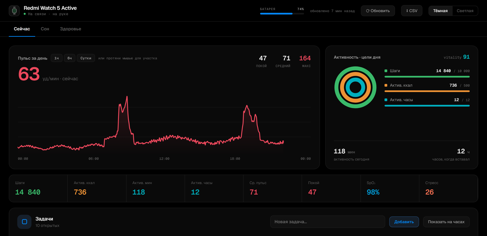
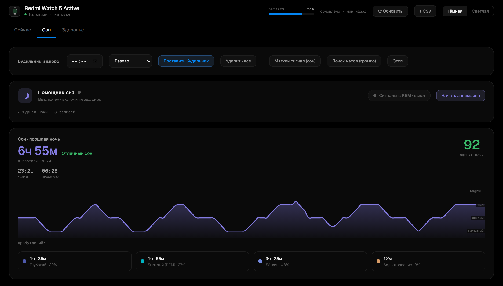
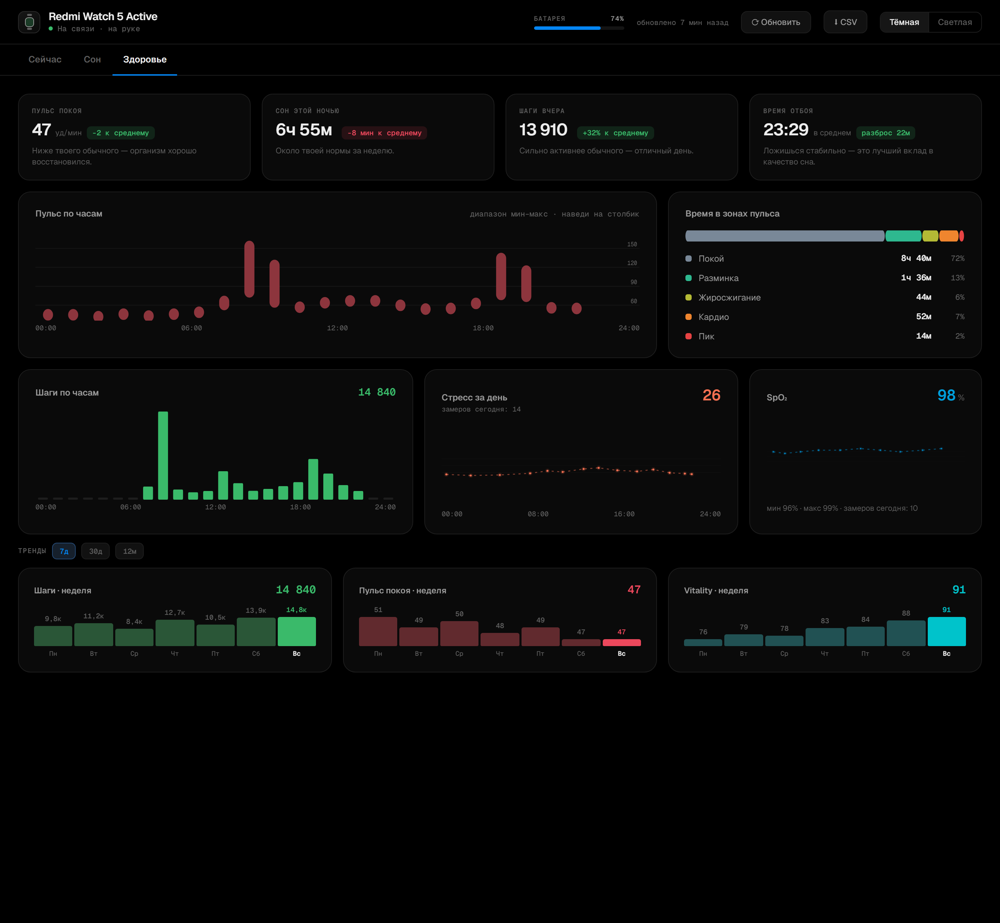

# Redmi Watch 5 Active → ПК: живой дашборд, движок сна и умный будильник

Самостоятельный **порт протокола Xiaomi из Gadgetbridge на Windows/Python**. Программа
подключается к часам по Bluetooth Classic (SPP), проходит шифрованную аутентификацию и
превращает дешёвые часы в источник данных для собственного дашборда: живой пульс,
история сна с фазами, месячные и годовые тренды — и **движок сна с мягкими сигналами в
REM-окне и гарантированным умным будильником.**

> Производная работа от **Gadgetbridge** (лицензия **AGPLv3**). Протокол реверсили они —
> спасибо проекту. Здесь он портирован на Python и надстроен продуктовой логикой.

Данные, которые собирают эти часы, обычно живут только в облаке Xiaomi. Проект забирает
их себе: часы становятся датчиком, а источником истины — локальный дашборд.

---

## Скриншоты

Дашборд разнесён по вкладкам под частоту использования. Кадры — витринный режим
(`/demo`, синтетический «идеальный день»), тёмная тема.

**Сейчас** — пульс в реальном времени, кольца целей дня, задачи:



**Сон** — гипнограмма с оценкой ночи, помощник сна (сигналы в REM) и умный будильник:



**Здоровье** — пульс по часам, зоны пульса, шаги, стресс, SpO₂ и недельные тренды:



---

## Что умеет

- **Живой дашборд** (`http://127.0.0.1:8765`) — пульс в реальном времени, кольца целей,
  поминутные кривые пульса/SpO₂/стресса, зоны пульса, шаги по часам. Одностраничный,
  тёмная/светлая тема, зум и наведение на графиках.
- **Сон с фазами** — гипнограмма как в топовых сон-приложениях (плавная волна глубины),
  оценка ночи, честная разбивка глубокий/REM/лёгкий (или «нет данных», если часы не
  считали фазы — см. «Честность данных»).
- **Движок сна / lucid** — использует стадии REM от часов (когда часы их дают), а иначе шлёт мягкий буз в
  статистическом окне REM по времени — на этом железе пульс REM-фазу не различает; **гарантированный умный будильник** после ~6 ч сна с эскалацией
  (мягкие сигналы → сирена → резервный аппаратный будильник на самих часах).
- **Тренды без сброса** — 7 дней / 30 дней / 12 месяцев; агрегаты хранятся вечно.
- **Задачи с двусторонним синком в часы** — список дел на дашборде зеркалится в
  **нативное приложение «Напоминания»** на часах (не уведомлением!): добавил на ПК —
  появилось на запястье; отметил на часах — на ПК зачеркнулось. Reminder-подтип
  протокола реверсирован и проверен на железе.
- **Уведомления ПК → часы** с кастомной иконкой (свой битмап, портированная конвертация
  пиксель-форматов), будильник и вибро с ПК, системный трей.

Нет железа под рукой? Открой **`/demo`** — витринная страница на синтетическом «идеальном
дне» (реалистичный пульс, полные кольца, отличная ночь), не смешивается с реальными данными.

---

## Архитектура

Вертикальные слайсы: общая «сантехника» в `core/`, каждая фича — самостоятельная папка
в `features/` (карта кода — [`FEATURES.md`](FEATURES.md), конвенции —
[`docs/CONVENTIONS.md`](docs/CONVENTIONS.md)):

| Слой | Что делает |
|---|---|
| `core/client.py` | BT SPP стейт-машина: рукопожатие, кадры, realtime, reconnect |
| `spp.py` / `xcrypto.py` / `miniproto.py` | кадрирование v1/v2, miwear-auth + AES-CTR, мини-protobuf |
| `activity.py` | парсеры файлов активности (день/детали/сон/стадии) — **байт-в-байт** с Gadgetbridge |
| `core/store.py` | SQLite (дни/сон — вечно, поминутка 90 дн, сэмплы 14 дн, задачи) |
| `core/router.py` | HTTP-роутер: фичи регистрируют свои маршруты |
| `core/watch_io.py` | арбитр единственного BT-канала: приоритеты (будильник > lucid > задачи), дедуп |
| `features/sleep/` | движок сна: чистое ядро `decide()` + тик-цикл (lucid, умный будильник, авто-ночь) |
| `features/todos/` | задачи: CRUD + двусторонний синк с нативными напоминаниями часов |
| `dashboard.py` | состояние + модель `/state` + сборка приложения |
| `index.dc.html` | фронт (design-canvas HTML, `{{ }}`-биндинги, вкладки) |
| `service.py` | супервайзер: закалённый старт, reconnect-цикл, watchdog |

---

## Инженерные детали, которыми горжусь

- **Реверс живого Bluetooth-протокола**, а не туториал: шифрованный handshake, AES-CTR с
  IV=ключ на пакет, CRC-16/ARC, protobuf без зависимостей. Всё покрыто оффлайн-тестами,
  которые эмулируют сторону часов.
- **Байт-в-байт парсеры** файлов активности со ссылками на исходник Gadgetbridge —
  offset'ы не угадываются, а сверялись с реальными дампами часов (сами дампы — личная
  биометрия и в репо не публикуются; тесты гоняют синтетические кейсы).
- **«Тихая ночь» — находка из данных.** Оказалось, что каждый наш опрос файла сна часы
  записывают как минуту бодрствования (совпадение 14/14 с моментами синков) и ломают
  детект REM. Решение: пока пользователь спит, часы не опрашиваются вообще — движок
  работает по секундному пульсу, а один синк тянет всю ночь после пробуждения.
- **Задачи в нативных «Напоминаниях» часов.** Reminder-подтип schedule-сервиса
  восстановлен из proto Gadgetbridge и проверен на железе: создание/удаление по id,
  привязка ack-ответа часов к конкретной задаче (FIFO по единственному каналу).
  Отдельно пойман глюк прошивки — часы иногда отдают **пустой список** напоминаний
  посреди потока; наивный синк пометил бы всё «выполненным», поэтому reconcile требует
  «видел раньше + пропало два опроса подряд».

---

## Как это построено

Правила разработки зафиксированы в файлах репо, а не держатся в голове:

- **[`docs/CONVENTIONS.md`](docs/CONVENTIONS.md)** — источник правды: план-до-кода,
  слои, честность данных, чек-лист Definition of Done.
- **5 тестовых сьютов** (`run_tests.py`) — golden-реплеи реальных ночей через чистое
  ядро `decide()`, синтетические байт-кейсы парсеров, крипто/кадрирование, задачи,
  арбитр канала; `deploy.ps1` не деплоит на красных тестах, `hooks/pre-commit`
  не даёт закоммитить.

### Баги, пойманные не глазами, а инвариантами

1. **Парсер сна суммировал дубли** — часы дописывают копию пакетов при каждом синке;
   REM раздувался в 4–15×. Поймано сверкой «сумма стадий == длительность».
2. **Нули как факт** — `rem = 0` показывался как «REM не было», хотя байт-флаг говорил
   «часы фазы не мерили». Поймано в сырых байтах → стало «нет данных».
3. **Будильник сработал днём** на тестовой сессии — поймано в логах решений движка,
   которые добавлены заранее именно для этого. Фикс: гард «только-ночь».

---

## Установка и запуск (Windows)

```powershell
cd redmi_watch5_live
py -m pip install -r requirements.txt

# 1) скопировать пример конфига и вписать свой COM-порт + auth-ключ:
copy config.example.json config.json
py client.py --list          # найти COM-порт спаренных часов

# 2) запуск сервиса (дашборд + движок):
powershell -ExecutionPolicy Bypass -File deploy.ps1   # прогоняет тесты, стартует сервис
# дашборд: http://127.0.0.1:8765   ·   витрина без железа: http://127.0.0.1:8765/demo

# тесты:
py run_tests.py
```

### Два обязательных условия

1. **Auth-ключ (16 байт).** Часы не пускают без ключа из привязки в Mi Fitness. Из-под
   Windows его не достать — нужен **один раз Android** (методы в вики Gadgetbridge
   «Pairing types and Auth Key»: `adb logcat` при привязке, либо база приложения). Ключ
   кладётся в `config.json` (он в `.gitignore` — в репо едет только `config.example.json`).
2. **Канал данных у часов один.** Пока читает ПК, телефон данных не получает — закрой
   Mi Fitness / отвяжи часы от телефона, иначе ПК не получит SPP-канал.

---

## Приватность

Это личные биометрические данные. Из репо **исключены** (`.gitignore`): `config.json`
(ключ часов), `history.db` (вся история пульса/сна), логи, а также `captures/*.bin`
(реальные дампы часов — локальные фикстуры парсеров, в репо не едут; `test_activity.py`
сам пропускает их, если файлов нет, и гоняет синтетические кейсы).

---

## Тесты и лицензия

- `run_tests.py` = `selftest.py` (крипто/кадры/protobuf) + `test_activity.py` (парсеры:
  синтетика всегда, реальные дампы — если есть локально) + `test_sleep_engine.py`
  (реплеи реальных ночей через `decide()`) + `test_todos.py` + `test_watch_io.py`.
- Источник протокола — Gadgetbridge, пакет `service/devices/xiaomi` (**AGPLv3**):
  <https://codeberg.org/Freeyourgadget/Gadgetbridge>
